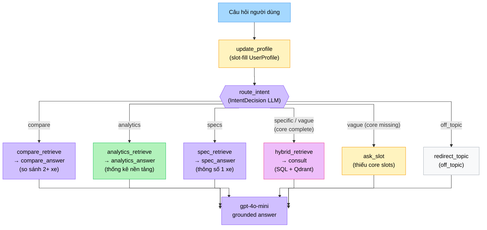
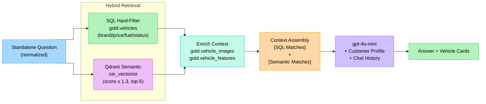
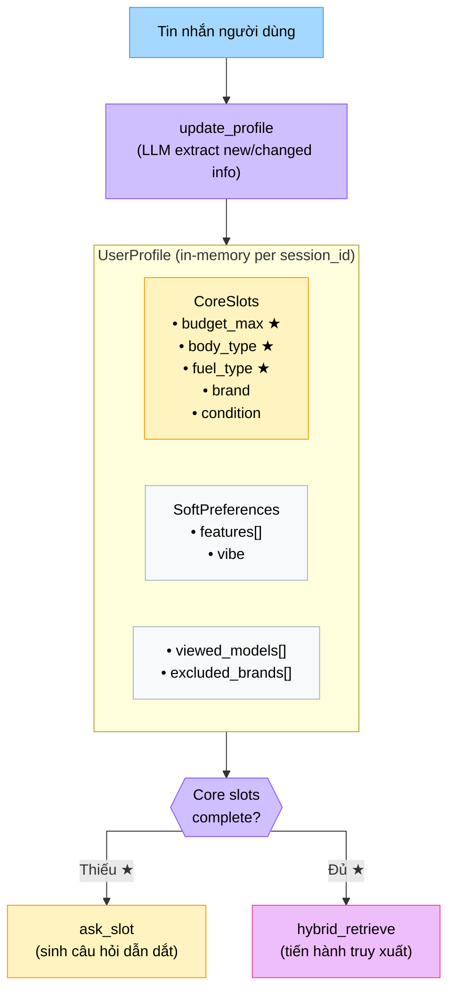

# Hướng dẫn tạo hình ảnh cho ChatBot.tex

## Hình đã có, dùng được

| File | Vị trí | Ghi chú |
|------|--------|---------|
| `RAG_graph.png` | `images/RAG_graph.png` | Đã dùng ở §Mô hình cơ sở, caption đã được sửa thành "mô hình RAG tổng quát làm nền tảng lý thuyết" |
| `rag_model.png` | `images/rag_model.png` | Chưa dùng — có thể bổ sung nếu muốn thêm hình về memory builder |

---

## 4 Hình nên tạo mới

### Hình 1: `chatbot_langgraph.png` — LangGraph Agentic Graph
**Nguồn:** Diagram #5 trong [`docs/architecture/diagrams.md`](file:///c:/Users/Lenovo/Videos/car-recsys-consultant-chatbot/docs/architecture/diagrams.md) (dòng 177–207)

**Cách export:**
1. Copy đoạn Mermaid (dòng 178–207) từ `diagrams.md`
2. Dán vào [mermaid.live](https://mermaid.live)
3. Export PNG → lưu vào `images/chatbot_langgraph.png`

**Vị trí thêm vào ChatBot.tex:** Cuối §Kiến trúc Agentic (sau đoạn giới thiệu StateGraph, trước §Hồ sơ người dùng)

```latex
\begin{figure}[!htbp]
    \centering
    \includegraphics[width=1\linewidth]{chatbot_langgraph.png}
    \caption{Kiến trúc Agentic LangGraph của chatbot tư vấn xe (chatbot v2)}
    \label{fig:chatbot-langgraph}
\end{figure}
\FloatBarrier
```

---

### Hình 2: `chatbot_intent_routing.png` — Intent Routing Flow

**Nội dung cần vẽ:** Flow diagram thể hiện 7 intent và nhánh xử lý. Copy Mermaid sau và render tại mermaid.live:



**Lưu vào:** `images/chatbot_intent_routing.png`

**Vị trí thêm vào ChatBot.tex:** Cuối §Phân loại ý định (sau bảng 7 intent)

```latex
\begin{figure}[!htbp]
    \centering
    \includegraphics[width=1\linewidth]{chatbot_intent_routing.png}
    \caption{Luồng định tuyến ý định trong LangGraph (7 intent → nhánh chuyên biệt)}
    \label{fig:chatbot-intent-routing}
\end{figure}
\FloatBarrier
```

---

### Hình 3: `chatbot_hybrid_retrieval.png` — Hybrid Retrieval Flow

**Nội dung cần vẽ:** Hybrid SQL + Qdrant retrieval và context assembly:



**Lưu vào:** `images/chatbot_hybrid_retrieval.png`

**Vị trí thêm vào ChatBot.tex:** Cuối §Hybrid Retrieval (sau mô tả SQL + Qdrant)

```latex
\begin{figure}[!htbp]
    \centering
    \includegraphics[width=1\linewidth]{chatbot_hybrid_retrieval.png}
    \caption{Luồng Hybrid Retrieval: SQL hard-filter kết hợp Qdrant semantic search}
    \label{fig:chatbot-hybrid-retrieval}
\end{figure}
\FloatBarrier
```

---

### Hình 4: `user_profile_slots.png` — UserProfile Structure

**Nội dung cần vẽ:** Cấu trúc UserProfile và cơ chế slot-fill:



**Lưu vào:** `images/user_profile_slots.png`

**Vị trí thêm vào ChatBot.tex:** Cuối §Hồ sơ người dùng

```latex
\begin{figure}[!htbp]
    \centering
    \includegraphics[width=0.9\linewidth]{user_profile_slots.png}
    \caption{Cấu trúc UserProfile và cơ chế slot-fill trong chatbot}
    \label{fig:user-profile-slots}
\end{figure}
\FloatBarrier
```

---

## Tóm tắt vị trí thêm hình vào ChatBot.tex

| # | File | Section | Vị trí cụ thể |
|---|------|---------|---------------|
| 1 | `RAG_graph.png` | §Mô hình cơ sở | Đã có — caption đã sửa ✅ |
| 2 | `chatbot_langgraph.png` | §Kiến trúc Agentic | Sau đoạn giới thiệu StateGraph 12 nodes |
| 3 | `user_profile_slots.png` | §Hồ sơ người dùng | Sau mô tả CoreSlots + ask\_slot |
| 4 | `chatbot_intent_routing.png` | §Phân loại ý định | Sau bảng 7 intent |
| 5 | `chatbot_hybrid_retrieval.png` | §Hybrid Retrieval | Sau mô tả SQL + Qdrant |

> [!TIP]
> Export nhanh nhất: Dùng [mermaid.live](https://mermaid.live), paste code, chọn **PNG** → Download. Lưu vào `car-recsys-system/do_an_cuoi_ki_1_nam_4/images/`.
